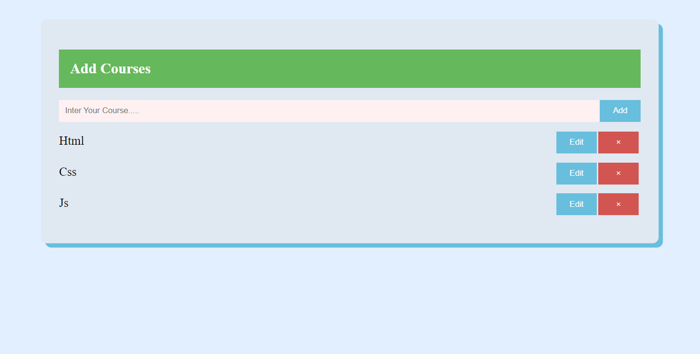

# Crud App

It is very simple Add Course application written with react.js to add courses and have other functions, for instance, function to add course and another to delet course after finishing and function to edit course if you want to change course, last function to submit change.

## Live Demo
 - link: https://ahmed-abo-rafat.github.io/Crud_App/

## To begin:
``npx create-react-app my-app`` 
``cd my-app`` 
replace the public and src folders with those in this repo. 
``npm start``

## Technologies
Project is created with:
  - React.Js
  - html
  - css

## Features
  - Function to add items: it is add courses to the list
  - Delet item: it is x icon to delet item from list.
  - Edit item: function to edit new value to list.
  - Update item: function to submit new value to the list of course

### Result

